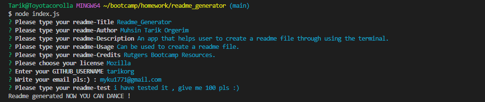
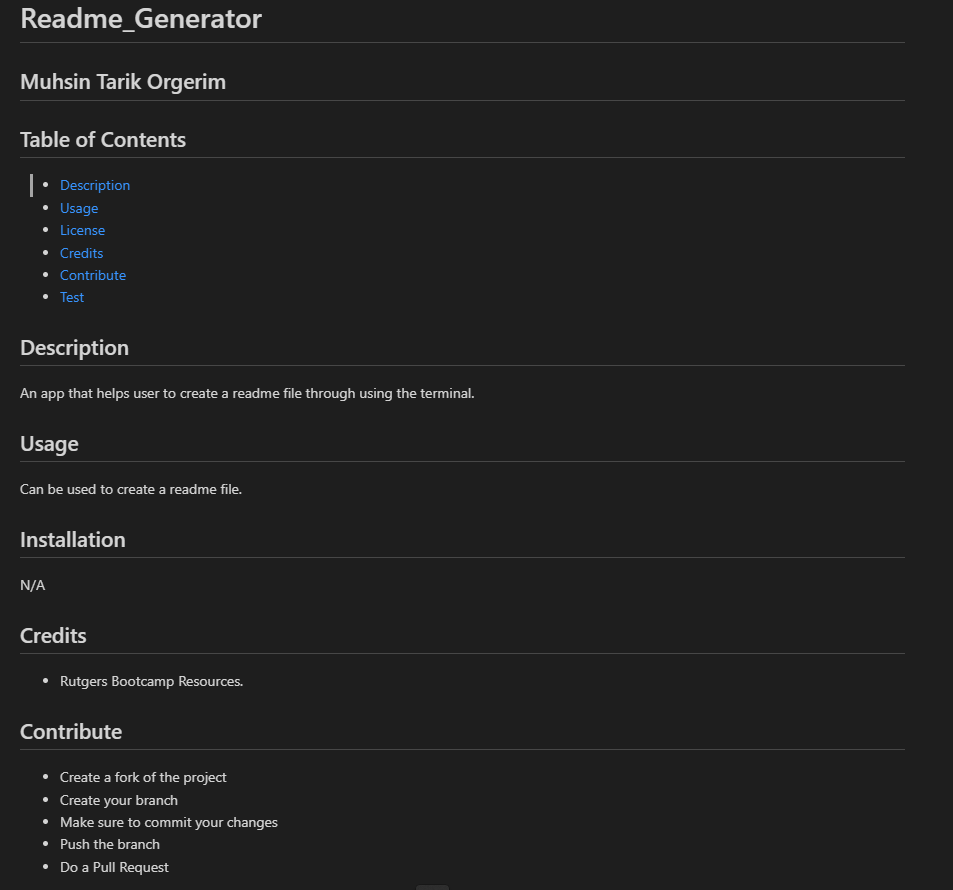

  # Readme_Generator

  ## Muhsin Tarik Orgerim

  ## Table of Contents
  - [Description](#description)
  - [Usage](#usage)
  - [License](#license)
  - [Credits](#credits)
  - [Contribute](#contribute)
  

  ## Visuals
  
  

  # Description
  An app that helps user to create a readme file through using the terminal. readme file will be created accordingly after the user interaction through terminal.

  ## Usage
  Can be used to create a readme file. User will be asked required informations inside terminal!

  ## Installation
  N/A

  ## Credits
  - Rutgers Bootcamp Resources.

  ## Contribute
  - Create a fork of the project
  - Create your branch
  - Make sure to commit your changes
  - Push the branch
  - Do a Pull Request

  ## Deployment
  - Link to my repo: https://github.com/tarikorg/readme_generator
  - Link to my Walkthrough: [Walkthrough video](https://drive.google.com/file/d/1RpnmdouIf3C4DkyqJxxNHySbDii4de8e/view?usp=sharing)

   
  ## Questions
  - Github username: https://github.com/tarikorg
  - Email: myku1771@gmail.com

  ## License
  This repository is under the MIT license.
  - Covered Software is provided under this License on an “as is” basis, without warranty of any kind, either expressed, implied, or statutory, including, without limitation, warranties that the Covered Software is free of defects, merchantable, fit for a particular purpose or non-infringing. The entire risk as to the quality and performance of the Covered Software is with You. Should any Covered Software prove defective in any respect, You (not any Contributor) assume the cost of any necessary servicing, repair, or correction. This disclaimer of warranty constitutes an essential part of this License. No use of any Covered Software is authorized under this License except under this disclaimer.
  - License link => [License Link](https://opensource.org/licenses/MIT)
  - 

